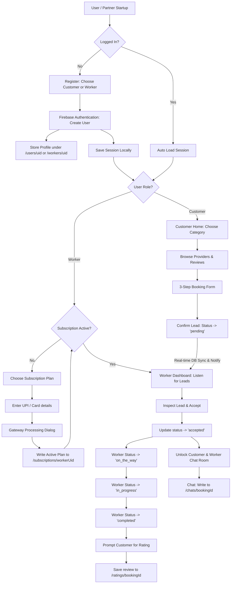

# Gigdial Platform: Complete Platform Workflow Documentation

This document describes the complete flow and architecture of the **Gigdial** platform. The platform is structured as a multi-app project containing three key workspaces/flavors: **Customer**, **Worker (Partner)**, and **Admin (Control)**. All applications are synchronized in real-time using Firebase Authentication and Firebase Realtime Database.

---

## 1. System Architecture & State Synchronization

The central state management is defined in `booking_state.dart` (which is shared across the workspace directories). The application utilizes a singleton class `BookingState` that connects to the following Firebase Realtime Database nodes:

- **`/users`**: Stores client/customer account information. Mapped as `/users/$uid` where `$uid` is the Firebase Authentication unique identifier.
- **`/workers`**: Stores service provider profiles, experiences, and professions. Mapped as `/workers/$uid` where `$uid` is the Firebase Authentication unique identifier.
- **`/bookings`**: Stores service requests generated by customers (title, description, customer/worker association, price, and current status).
- **`/chats`**: Stores real-time message logs mapped to individual `bookingId` nodes (completely clean from auto-reply simulation bots). Mapped as `/chats/$bookingId`.
- **`/subscriptions`**: Stores active payment subscriptions for workers. Mapped as `/subscriptions/$workerUid`.
- **`/payments`**: Stores payment and transaction records for worker subscriptions. Mapped as `/payments/$paymentId`.
- **`/ratings`**: Stores reviews and ratings posted by customers upon job completion. Mapped as `/ratings/$bookingId`.
- **`/notifications`**: Stores real-time user notification logs. Mapped as `/notifications/$uid`.

---

## 2. Platform Flowchart Overview



---

## 3. Detailed Workflow Phase Details

### Phase A: Onboarding & Authentication
1. **Splash & Onboarding**: The app starts with a splash introduction (`splash_screen.dart`) followed by onboarding slides.
2. **Registration & UID-based Profiles**:
   - Authentication is handled via **Firebase Authentication**.
   - Upon successful signup, the user gets a unique `uid`.
   - Customer profile details (Name, Phone, Email) are written directly to `/users/$uid`.
   - Worker profile details are written directly to `/workers/$uid`.
3. **Session Persistence**:
   - The user session is stored locally to maintain state.
   - Upon restarts, `BookingState` automatically logs in/restores session to retrieve user details from `/users/$uid` or `/workers/$uid`.

### Phase B: Customer Booking Flow
1. **Browse Categories**: The customer selects categories (Electrician, Plumber, AC Repair, etc.) from `home_screen.dart`.
2. **Select Worker**: The customer browses workers listing in `service_listing_screen.dart` and views their details in `worker_profile_screen.dart`.
3. **Checkout Process** (`book_service_screen.dart`):
   - **Step 1**: Details input (work title, address, schedule, description).
   - **Step 2**: Professional selection (filters available workers matching the category).
   - **Step 3**: Price summary breakdown. Tapping "Confirm" uploads the booking to `/bookings` node with status `pending` and writes a notification to `/notifications/$workerUid`.

### Phase C: Worker Lead & Subscription Flow
1. **Subscription Enforcement**:
   - Workers must have an active subscription record in `/subscriptions/$workerUid` (status: `"active"`) to access and process incoming leads.
   - If inactive, they choose a plan (Professional, Premium, Elite) in `subscription_plans_screen.dart`.
2. **Dynamic Payments**:
   - Workers select from UPI (Google Pay, Paytm, PhonePe), Cards, Net Banking, or Wallets in `payment_screen.dart`.
   - The system displays dynamic fields corresponding to the selected payment method.
   - Tapping "Pay" initiates a simulated payment gateway sequence.
   - On success, `buySubscription()` pushes the updated subscription structure under `/subscriptions/$workerUid`:
     ```json
     {
       "plan": "Premium",
       "startDate": 1750750000,
       "endDate": 1753350000,
       "status": "active"
     }
     ```
3. **Lead Processing & Advanced Statuses**:
   - The worker dashboard displays stats and filters leads into **Pending Leads** and **Active / Completed**.
   - Workers tap a pending lead, inspect it in `lead_details_screen.dart`, and tap **"Accept Lead"** to update its status to `accepted`.
   - The worker can then advance the job status step-by-step:
     * `accepted` -> **"Start Journey"** -> status updates to `on_the_way`.
     * `on_the_way` -> **"Start Work"** -> status updates to `in_progress`.
     * `in_progress` -> **"Complete Work"** -> status updates to `completed`.
     * Booking status can also transition to `cancelled` if aborted by user or worker.

### Phase D: Real-Time Chat & Contact Flow
1. **Communication Unlock**: Once a lead is accepted, the "Chat" button unlocks.
2. **Real-time Messaging**:
   - Both Customer and Worker access the `chat_room_screen.dart`.
   - Messages are written directly to `/chats/$bookingId` database paths.
   - The app listens to database updates and triggers UI rebuilds immediately. A real-time notification is written to `/notifications/$recipientId` when a message is received.

### Phase E: Ratings & Reviews Flow
1. **Review Prompt**: Once the booking status changes to `completed`, the customer app triggers a popup/sheet asking to review the service.
2. **Database Record**: The customer inputs a rating (1 to 5 stars) and a textual review. This is saved to:
   ```json
   {
     "ratings": {
       "bookingId": {
         "workerId": "workerUid",
         "customerId": "customerUid",
         "rating": 5,
         "review": "Excellent work"
       }
     }
   }
   ```
3. **Rating Calculation**: The worker's average rating displays dynamically based on reviews stored under this node.

### Phase F: Profile Modification Flow
1. **Details Editing**:
   - Under the "Profile" tab, clicking **"Edit Profile"** launches a dialog populated with the current Name, Phone, and Email.
   - Pressing "Save" calls `updateUserProfile(name, phone, email)`.
   - This patches `/users/$uid` (for customer) or `/workers/$uid` (for worker) on Firebase.
   - Local state triggers listeners to rebuild the profile card instantly.

### Phase G: Admin Moderation
1. **Overview Dashboard**: Tracks registered users, active service workers, platform bookings, and revenue metrics.
2. **Moderation Override**: The admin panel allows suspension/reactivation of users and approval/suspension of workers.

### Phase H: Payment & Revenue Management
1. **View Payments & Subscriptions**: View worker subscription transaction history mapped directly from `/payments/$paymentId`.
2. **Revenue Analytics**: Compute total platform revenue dynamically by checking successful payment records.
3. **Refunds & Reversals**: Allows admins to reverse or refund transactions directly, patching their status in the Firebase Realtime Database.
4. **Export Reports**: Allows admins to trigger CSV/PDF payment data reports downloads.
```
